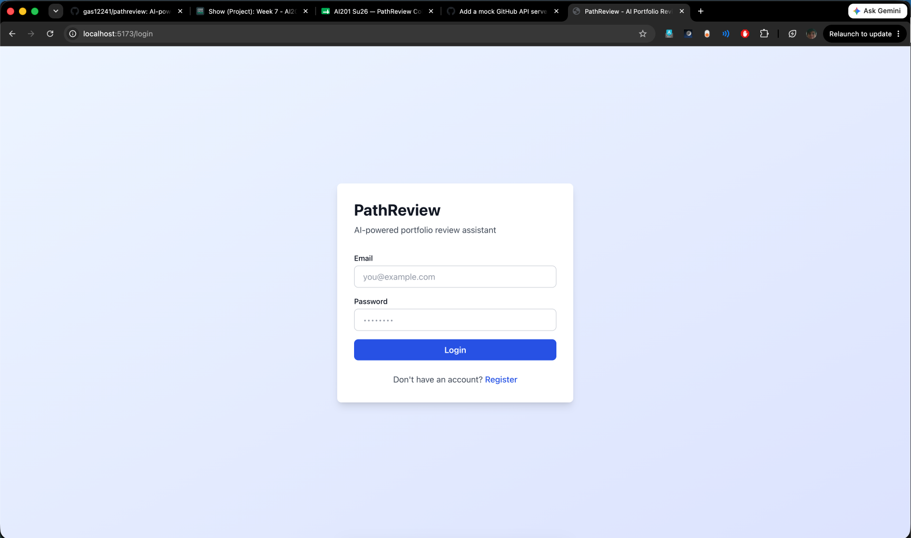

## Week 7 — Issue selection

**Issue link:** https://github.com/ascherj/pathreview/issues/57

**Issue title:** Add a mock GitHub API server for integration tests

**Tier:** [ ] Tier 1 [x] Tier 2 [ ] Tier 3

**Problem summary:**
There are integration tests in `tests/integration/test_github_tool.py` that are skipped
because they need live API access. This means that the there is no automated coverage
running as part of the test suite. The fix would be to setup a lightweight mock server
(using `pytest-httpserver` or similar) that returns responses from files in
`tests/fixtures/github_responses/`, which would enable GitHub tool tests. Once done,
tests should run without problem during CI and catch any regressions in how the agent
parses and handles GitHub API responses.

### "Is this right for me?" checklist

**Selection Reasoning:**
I chose this problem for a few reasons. First, it is a tier-2 problem which goes in line with my experience working in open Source up until now. Originally, I also believed that I could work on at least two different things from this issue. The first is that working with tests can challenge your ability to reason through code you did not write, since you're testing or working to make sure code (you didn't write) does not break. The second thing I wanted to challenge myself with came from the CI/CD portion of the issue, where I will be working with Github tool tests to make sure that integration tests can be ran.

**Personal Skill Statement** I have done one open source contribution (in AI301) so I wanted to go for something harder than tier 1. I don't know if I am confident enough for a Tier 3 problem, so I chose something in the middle. Looking at the code base,

[x] I can explain the problem and the expected behavior in 2–3 sentences without reading the issue.

[x] I've located the relevant files and confirmed they exist in the codebase.

[x] I can describe a concrete before-and-after: what the user sees before the fix and what they see after.

[ ] If this is my first open source contribution: I'm choosing Tier 1.

[x] If I've contributed to large codebases before: Tier 2 or 3 is fair game.

[x] I'm not choosing a Tier 3 issue to "challenge myself" if I haven't completed a Tier 1 or 2 first — scope surprises in Week 9 don't have a safety net.

[x] I've found and read the specific code the issue references (not just the file — the function or section).

[x] I've read enough surrounding context that I can write a rough plan for the fix without looking anything up.

[x] I've found the test file for my module and read at least one test end-to-end.

[x] I've checked the issue comments and the ledger's Claims count, and I'm fine with how many others are on this issue.

[x] I've estimated the time this will take and I'm confident I can complete it before the Week 9 deadline.

[x] This issue has no open blockers or dependencies on other unresolved issues.

**Branch name:** test/57-mock-github-api

**Setup confirmation:** [x] App runs locally at localhost:5173

**Screenshot of local server running**

**Cohort ledger:** [x] Issue added to cohort ledger

**Screenshot of Cohort Ledger**

## Week 8 — Reproduction & solution planning

**Reproduction commit link:** https://github.com/gas12241/pathreview/commit/92d8914

**Reproduction summary:**
Wrote a test calling GitHubTool against the live GitHub API with no mocking. It passed, but confirmed the tool has no fixture-based path — every run consumes GitHub's unauthenticated rate limit (60 req/hour per IP, already at 57 remaining after a few manual checks), which is exactly why these tests can't run reliably in CI today.

**PLAN.md link:** https://github.com/gas12241/pathreview/blob/test/57-mock-github-api/PLAN.md

**Walkthrough video (recommended):** https://youtu.be/h86U--Vp6Yk

**Blockers or open questions:**
Going into week 9, I don't believe I have any blockers or open questions!
